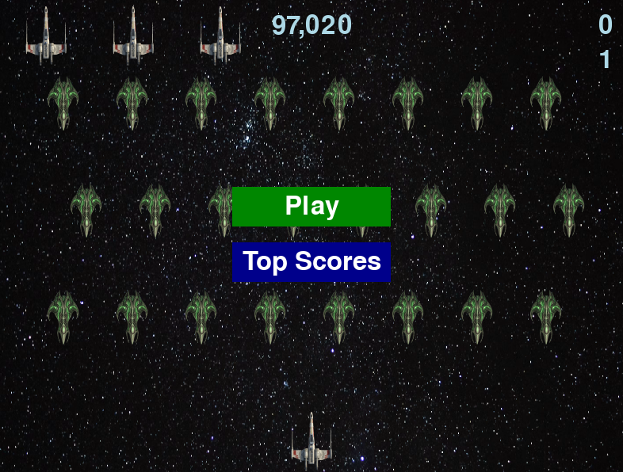

# 🚀 Alien Invasion Game

This is a fully functional implementation of the classic game "Alien Invasion" using Python and `pygame`. The game features a player-controlled ship that can move left, right, and shoot at 👾 aliens that appear from the top of the screen.

This was made as part of my learning journey from the **Python Crash course by Eric Matthews** Book. Sound effects and gameplay have been polished and is now complete I have made the updates I wanted to do within this build, I am now finished, Feel free to clone and use the code as you please.

Images of Star-ship and Alien-ship were generated using Google Gemini to give the game a modern feel and the background is just a Google image of stars.

## 🤝 Contributing

Contributions are welcome! Whether it's a bug fix, a new feature, or a docs improvement, I'd love your help. Please check out the [CONTRIBUTING.md](CONTRIBUTING.md) guide for details on getting started, code style, and how to submit a pull request.

To report a security vulnerability, please follow the process in [SECURITY.md](SECURITY.md). 

## 📂 Project Structure

- `alien_invasion.py`: Main game file. Contains the `AlienInvasion` class which manages the game loop, events, and rendering.
- `ship.py`: Contains the `Ship` class which manages the player's spaceship movement and rendering.
- `alien.py`: Contains the `Alien` class which manages individual alien movement, edge checking, and rendering.
- `bullet.py`: Contains the `Bullet` class which manages bullet movement and rendering.
- `settings.py`: Contains all settings for the game, such as screen dimensions, colors, and speeds.
- `game_stats.py`: Contains the `GameStats` class which tracks game statistics like `ships_left`, `score`, and `level`.
- `scoreboard.py`: Contains the `Scoreboard` class which displays the score, level, high score, and remaining ships.
- `button.py`: Contains the `Button` class used for the "Play" button on the start screen.
- `dropdown.py`: Contains the `Dropdown` class used to pick a saved username on the name entry screen.
- `high_score_manager.py`: Handles reading and writing per-user high scores to `high_score.json`.

## Screenshot of Game start 


## 🏃 How to Run

1. Ensure you have Python installed on your system.
2. Ensure you have `uv` installed. In the project path, run:

   ```bash
   uv sync 
   ```

3. Run the game by executing:

   ```bash
   uv run alien_invasion.py
   ```

## ✨ Features

- **🚢 Ship Movement**: The player can move the ship left and right using the **Left** and **Right** arrow keys.
- **🔫 Shooting**: The player can shoot bullets at aliens using the **Space-bar**.
- **👾 Alien Fleet**: Aliens spawn in a grid, move horizontally, drop down, and reverse direction when they hit the screen edges.
- **💥 Collision Detection**:
  - Bullets destroy aliens.
  - Aliens destroy the ship upon collision.
  - Aliens destroy the ship if they reach the bottom of the screen.
- **📊 Game Statistics**: The game tracks the number of remaining ships (`ships_left`), current score, and level.
- **💀 Game Over**: When all ships are lost, the game stops and displays the final score.
- **🏆 Scoreboard**: Displays the current score, high score, level, and remaining ships.
- **❤️ Lives**: The game starts with 3 lives, represented by ship icons on the scoreboard.
- **📈 Progression**: As you clear waves of aliens, the game speed increases, and the point value for each alien increases.
- **🔊 Sound Effects**: Shooting and explosion sound effects with configurable volume.
- **🖼️ Background**: Custom background image scaled to screen.
- **📐 Zigzag Formation**: Aliens spawn in a staggered grid pattern for a more dynamic look.
- **👤 User Profiles**: Players are prompted to create or select a username before the game starts.
- **📋 Profile Dropdown**: Returning players can select their saved username from a dropdown instead of retyping it (click to open, arrow keys to navigate, Enter to select).
- **💾 Per-User High Scores**: High scores are saved and loaded per username. The menu shows the global top score, and during play it shows the current player's personal best.
- **🏆 Top Scores Leaderboard**: Dedicated leaderboard screen showing the top 5 high scores across all users, accessible via the dark blue "Top Scores" button on the main menu.

## 🎮 Controls

- **⬅️/➡️ Left/Right Arrow Keys**: Move the ship.
- **⎵ Space-bar**: Fire a bullet.
- **🖱️ Menu Navigation**: Click "Play" to start a game or "Top Scores" to view the top 5 leaderboard (press **ESC** or click to return to the menu).
- **✍️ Name Entry Screen**: Type a username (Backspace to edit, up to 15 characters) or select one from the dropdown. Press **Enter** to start, **ESC** to return to the menu.
- **❌ Q**: Quit the game.

## 📄 License

This project is licensed under the MIT License - see the [LICENSE](LICENSE) file for details.

Happy Coding! ⌨️
